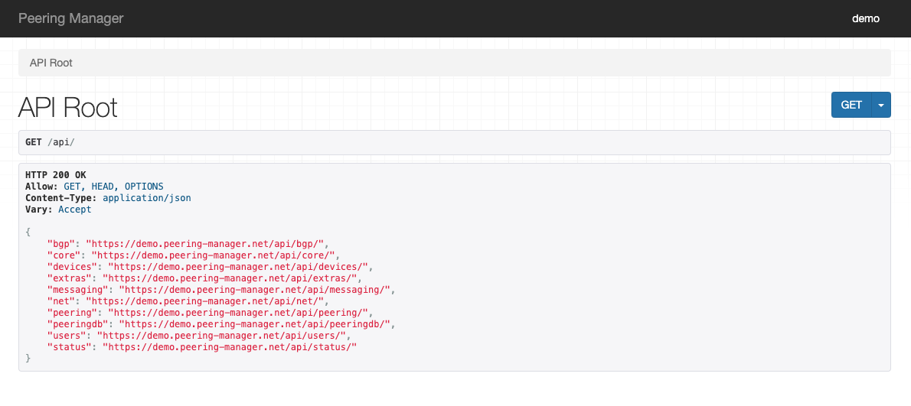

import ReferenceLink from "../../src/components/Card";
import Tabs from '@theme/Tabs';
import TabItem from '@theme/TabItem';

<!-- vale off -->
## What is Peering Manager?
<!-- vale on -->

Peering Manager lets you effortlessly manage and document your network’s peering sessions and interconnections with pre-configured data models and automation for seamless BGP session management.

## Sync directions supported

- Peering Manager → Infrahub
- Infrahub → Peering Manager

## Schema

Our `infrahub` repository contains an **example schema** that serves as a starting point for syncing Peering Manager data into Infrahub.
This schema follows best practices for Infrahub, **but it does not map the Peering Manager data model one-to-one** since Infrahub may have additional use cases.

This example is using the "base" demo schema and use an extension for Peering Manager.

<ReferenceLink title="Base Schema" url="https://github.com/opsmill/infrahub/blob/stable/models/base/" openInNewTab />
<ReferenceLink title="Peering Manager Extension" url="https://github.com/opsmill/infrahub/blob/stable/models/examples/extension_peering_manager.yml" openInNewTab />

### Installing the example schema

To install the example schema into Infrahub, follow these steps:

```bash
mkdir peeringmanager-sync
cd peeringmanager-sync

# Fetch the list of YAML file names from the peeringmanager folder
curl -s "https://api.github.com/repos/opsmill/infrahub/contents/models/base?ref=stable" | jq -r '.[].name | select(endswith(".yml"))' | while read file; do
  curl -O "https://raw.githubusercontent.com/opsmill/infrahub/refs/heads/stable/models/base/$file"
done
curl -O "https://raw.githubusercontent.com/opsmill/infrahub/refs/heads/stable/models/examples/extension_peering_manager.yml"

infrahubctl schema load *.yml
```

## Configuration

`infrahub-sync` allows defining what gets synchronized from a source to a destination.
Included in the examples there is two `config.yml` files that matches the example schema.

<ReferenceLink title="Source config.yml" url="https://github.com/opsmill/infrahub-sync/blob/main/examples/peering-manager_to_infrahub/config.yml" openInNewTab />
<ReferenceLink title="Destination config.yml" url="https://github.com/opsmill/infrahub-sync/blob/main/examples/infrahub_to_peering-manager/config.yml" openInNewTab />

To download those examples `config.yml`

```bash title="peering-manager to infrahub"
curl https://raw.githubusercontent.com/opsmill/infrahub-sync/refs/heads/main/examples/peering-manager_to_infrahub/config.yml > config.yml
```

```bash title="infrahub to peering-manager"
curl https://raw.githubusercontent.com/opsmill/infrahub-sync/refs/heads/main/examples/infrahub_to_peering-manager/config.yml > config.yml
```

### Configuration parameters

To instruct `infrahub-sync` to use the Peering Manager adapter, set `peeringmanager` in the direction 'name', you want to use for Peering Manager.

The settings dictionary is passed directly to the REST API client for Peering Manager for authentication and connection details.

Below is a snippet from the example config.yml file:

<Tabs>
  <TabItem value="Source example" default>

  ```yaml
  ---
  name: from-peering-manager
  source:
  name: peeringmanager
  settings:
      url: "https://<PEERING-MANAGER-ENDPOINT>"
      api_endpoint: "api" # Default value
      auth_method: "token" # Default value
      # auth_method: "token"
      token: "<TOKEN>"
  ```

  </TabItem>

  <TabItem value="Destination example">

  ```yaml
  ---
  name: to-peering-manager
  destination:
  name: peeringmanager
  settings:
      url: "https://<PEERING-MANAGER-ENDPOINT>"
      api_endpoint: "api" # Default value
      auth_method: "token" # Default value
      # auth_method: "token"
      token: "<TOKEN>"
      verify_ssl: true # Default value

  ```

  </TabItem>
</Tabs>

:::info

You can pass `params` for the REST API client, used by Peering Manager adapter, in the settings. For example `limit`

:::

### Schema mapping

The configuration file allows mapping tables from PeeringManager into Infrahub models.
Below is an example showing how to:

- Set the destination Infrahub model (`InfraBGPCommunity`)
- Map source data from Peering Manager (`peering/communities`)
- Specify field mappings between Peering Manager and Infrahub models

```yaml
  - name: InfraBGPCommunity
    mapping: peering/communities
    identifiers: ["name"]
    fields:
      - name: name
        mapping: slug
      - name: label
        mapping: name
      - name: description
        mapping: description
      - name: value
        mapping: value
      - name: community_type
        mapping: type
```

The models available on Peering Manager can be find in the /api of your instance.

<ReferenceLink title="Peering Manager API Swagger" url="https://demo.peering-manager.net/api/schema/swagger-ui" openInNewTab />

