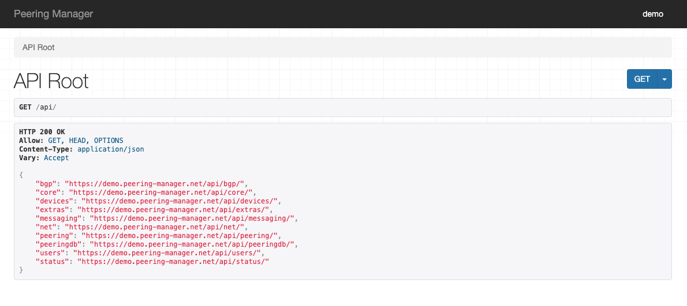

import ReferenceLink from "../../src/components/Card";

## Use this adapter

In a [configuration package](../configuration-package.mdx), name `peeringmanager` as the source. Then register the package, create and review a plan, and apply the plan, as described in [Run a sync](../running-a-sync.mdx).

On a Compose deployment, from source or from a release package, the worker receives only the Infrahub, NetBox, and Nautobot tokens, so this adapter's credentials cannot reach it in this release. See [Credentials on a Compose deployment](./choosing-an-adapter.mdx#credentials-on-a-compose-deployment).

<!-- vale off -->
## What is Peering Manager?
<!-- vale on -->

Peering Manager manages and documents the peering sessions and interconnections of a network, including BGP sessions.

## Sync directions supported

- Peering Manager → Infrahub

Peering Manager is a source only. Registration refuses a package that names `peeringmanager` as its destination, with the capability error. The repository still contains an `examples/infrahub_to_peering-manager/` mapping, which a registered run cannot use.

## Schema

Our `infrahub` repository contains an **example schema** that serves as a starting point for syncing Peering Manager data into Infrahub.
This schema follows best practices for Infrahub, **but it does not map the Peering Manager data model one-to-one** since Infrahub may have additional use cases.

This example is using the "base" demo schema and use an extension for Peering Manager.

<ReferenceLink title="Base Schema" url="https://github.com/opsmill/infrahub/blob/stable/models/base/" openInNewTab />
<ReferenceLink title="Peering Manager Extension" url="https://github.com/opsmill/infrahub/blob/stable/models/examples/extension_peering_manager.yml" openInNewTab />

### Installing the example schema

To install the example schema into Infrahub, follow these steps. This requires [`jq`](https://jqlang.org/) to parse the GitHub API response.

```bash
mkdir peeringmanager-sync
cd peeringmanager-sync

# Fetch the list of YAML file names from the models/base folder
curl -s "https://api.github.com/repos/opsmill/infrahub/contents/models/base?ref=stable" | jq -r '.[].name | select(endswith(".yml"))' | while read file; do
  curl -O "https://raw.githubusercontent.com/opsmill/infrahub/refs/heads/stable/models/base/$file"
done
curl -O "https://raw.githubusercontent.com/opsmill/infrahub/refs/heads/stable/models/examples/extension_peering_manager.yml"
```

Then load the downloaded files into the destination Infrahub as described in [Load an example schema into Infrahub](./choosing-an-adapter.mdx#load-an-example-schema-into-infrahub). Pass all of them to one command, for example `infrahubctl schema load *.yml --branch main`.

## Configuration

The repository contains a mapping example that matches the example schema: [`examples/peering-manager_to_infrahub/config.yml`](https://github.com/opsmill/infrahub-sync/blob/feature/v3-develop/examples/peering-manager_to_infrahub/config.yml). It is a `config.yml` file, not a package, and registration refuses it as it is. To use it, convert it as described in [Convert a config.yml file](../configuration-package.mdx#convert-a-configyml-file).

### Configuration parameters

Set `source.name` to `peeringmanager`. The adapter uses the Generic REST API client, so it accepts the same settings as the [Generic REST API adapter](./genericrestapi.mdx#configuration-parameters). In a registered package, the token is a `$credential` reference:

```yaml
format_version: 1
configuration:
  name: from-peering-manager
  source:
    name: peeringmanager
    settings:
      url: "https://peering-manager.example.com"
      api_endpoint: "api" # Default value
      auth_method: "token" # Default value
      token:
        $credential: peering-manager-token
  destination:
    name: infrahub
    settings:
      url: "https://infrahub.example.com"
      token:
        $credential: infrahub-token
credentials:
  peering-manager-token:
    provider: env
    identifier: INFRAHUB_SYNC_CREDENTIAL_PEERING_MANAGER_TOKEN
  infrahub-token:
    provider: env
    identifier: INFRAHUB_SYNC_CREDENTIAL_INFRAHUB_API_TOKEN
```

A registered package uses its declared settings and resolved credentials. For direct adapter use without a registered package, the adapter reads `PEERING_MANAGER_ADDRESS` or `PEERING_MANAGER_URL`, `PEERING_MANAGER_TOKEN`, and, for basic authentication, `PEERING_MANAGER_USERNAME` and `PEERING_MANAGER_PASSWORD`. These variables take precedence over declared settings. Bare `USERNAME` and `PASSWORD` variables are not read.

### Schema mapping

The mapping connects Peering Manager API paths to Infrahub kinds.
Below is an example showing how to:

- Set the destination Infrahub model (`InfraBGPCommunity`)
- Map source data from Peering Manager (`peering/communities`)
- Specify field mappings between Peering Manager and Infrahub models

```yaml
  - name: InfraBGPCommunity
    mapping: peering/communities
    identifiers: ["name"]
    fields:
      - name: name
        mapping: slug
      - name: label
        mapping: name
      - name: description
        mapping: description
      - name: value
        mapping: value
      - name: community_type
        mapping: type
```

The Peering Manager API paths are listed at `/api/` on your Peering Manager instance.

<ReferenceLink title="Peering Manager API Swagger" url="https://demo.peering-manager.net/api/schema/swagger-ui" openInNewTab />


