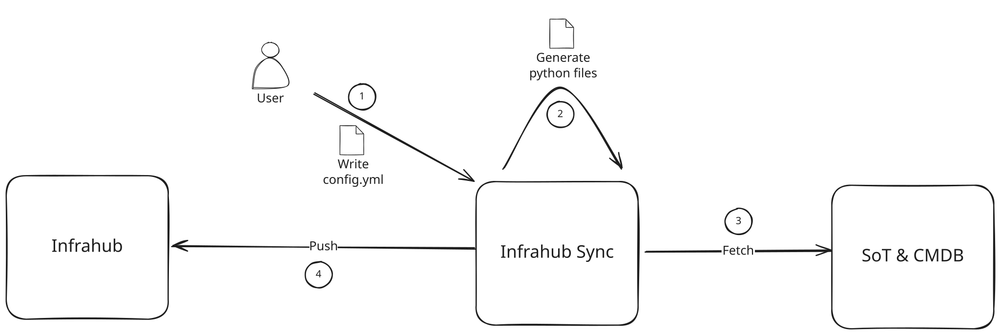

Learn how to use Infrahub Sync's commands to calculate differences, synchronize data, and apply previously cached plans against your destination.



:::info

Before generating the necessary Python code for your sync adapters and models and synchronizing, you need to create a configuration.
To create a new configuration, please refer to [Create a sync project](./creating-a-sync-project.mdx).

:::

## Listing available sync projects

```bash
infrahub-sync list --directory <your_configuration_directory>
```

Prints every sync project found under the given directory along with its source, destination, and on-disk location. Useful as a quick sanity check.

## Calculating differences

The `diff` command compares the source and destination without writing anything to the destination. It also writes a saved **plan artifact** to the local cache so you can review the change set and apply it later with `apply`.

### Command

```bash
infrahub-sync diff --name <sync_project_name> --directory <your_configuration_directory>
```

### Parameters

- `--name` — name of the sync project to diff.
- `--directory` — directory holding your sync configuration.
- `--branch` — Infrahub branch to diff against (default `main`).
- `--show-progress / --no-show-progress` — toggle the per-resource progress bar.
- `--run-id` — re-use a specific cache run id for the live comparison. A run that already holds a committed plan is refused: see [Plan generations are immutable](#plan-generations-are-immutable).
- `--concurrent-load / --no-concurrent-load` — load source and destination concurrently (default on). Disable if a custom adapter isn't thread-safe; see [Concurrent loads](#concurrent-loads) below.
- `--full-extract / --no-full-extract` — default on; re-extract everything every run. Pass `--no-full-extract` to enable the cursor-driven incremental warm path. See [Incremental extraction](./reference/incremental-extraction).
- `--from-plan <run-id>` — review the saved plan of a previous run instead of comparing live systems. See [Reviewing a saved plan](#reviewing-a-saved-plan) below.
- `--detail` — expand the review to one record per operation. Requires `--from-plan <run-id>`.
- `--kind <kind>` — narrow `--detail` to a single destination kind. Requires `--from-plan <run-id>` and `--detail`.

Each invocation logs a `Cached run <run_id> at <run_dir>` line on success. Note that id — you can hand it to `diff --from-plan <run-id>` to review the plan, and to `apply --run-id <run-id>` to apply it without re-extracting the source.

## Synchronizing data

The `sync` command runs `diff` and immediately applies the changes to the destination.

### Command

```bash
infrahub-sync sync --name <sync_project_name> --directory <your_configuration_directory>
```

### Parameters

- `--name` — name of the sync project to run.
- `--directory` — directory holding your sync configuration.
- `--branch` — Infrahub branch to sync against (default `main`).
- `--diff / --no-diff` — print the diff before syncing (default on).
- `--show-progress / --no-show-progress` — progress bar during sync.
- `--parallel / --no-parallel` — run tier-by-tier using the auto-computed dep graph (default on). Requires `order:` to be omitted from `config.yml` (see [Auto-tiered execution](./reference/config#auto-tiered-execution)). Falls back to serial when `order:` is set; a warning is logged so the no-op is visible.
- `--allow-rowcount-drop / --no-allow-rowcount-drop` — bypass the rowcount guardrail. Use only when you know the source intentionally shrank — otherwise sync refuses to proceed when any resource's row count has dropped by more than 50% since the last successful run.
- `--continue-on-error / --no-continue-on-error` — log and skip peer relationships whose identifier values are missing while **loading** a system, instead of aborting the run. Useful when source data is partial; review the warnings before relying on the result. It does not cover an unresolvable reference in the *source* data — see [Unresolvable source references fail the run](#unresolvable-source-references-fail-the-run) below.
- `--concurrent-load / --no-concurrent-load` — load source and destination concurrently (default on). See [Concurrent loads](#concurrent-loads) below.
- `--full-extract / --no-full-extract` — default on. Pass `--no-full-extract` for the cursor-driven incremental warm path; see [Incremental extraction](./reference/incremental-extraction).

Example:

```bash
infrahub-sync sync --name my_project --directory configs --diff --show-progress
```

### Unresolvable source references fail the run

Both `diff` and `sync` derive a plan from the
comparison before anything is written, and a source record referencing a peer the loaded source
cannot resolve **fails the whole run** at that point:

```text
ERROR | The peer 'leaf-99' referenced by field 'device' of kind 'InterfacePhysical' is not present
        in the loaded store under any candidate peer kind. Candidate peer kinds tried: DcimDevice.
        Next action: Add the peer's kind to the configuration so it is loaded, or remove the
        relationship from the schema mapping.
```

The run stops with that error and **nothing is written to the destination**. Previously the same
source data completed: the destination write path logged `Unable to find … Ignored` for the
unresolvable link and carried on, so the object was written with that relationship silently absent.
A configuration created for older behavior can therefore fail after upgrading even when the source
and configuration have not changed.

**`--continue-on-error` does not soften it.** That flag covers peer identifiers missing while a
system is being *loaded*; a reference the source itself cannot resolve is fatal either way. The
reasoning is that a plan is a record of what would be written, and an operation whose relationship
was quietly dropped is not that — the reference is either resolvable and recorded, or the run
refuses and names it.

The remedy is in the error: add the peer's kind to `config.yml` so it is loaded, or drop the
relationship from the schema mapping. Both make the reference resolvable rather than suppressing it.

### Concurrent loads

Source and destination loads run on a 2-thread pool by default. They hit independent services, write to independent in-memory stores, and write to disjoint cache subdirectories (`A/` vs `B/`), so the two loads are safe to run in parallel — and roughly halve the wall-clock time spent in the load phase on real APIs.

Disable with `--no-concurrent-load` if a custom adapter you've plugged in isn't thread-safe (most aren't an issue — the built-in NetBox, Nautobot, and Infrahub adapters are all fine).

### Tier-by-tier execution

When `--parallel` is set and `order:` is omitted, Infrahub Sync derives a write-order graph from the `reference:` entries in your `schema_mapping` and groups kinds into tiers. The engine narrows the destination's working set to one tier at a time, so no tier starts until every kind in the previous tier has finished writing. See [Auto-tiered execution](./reference/config#auto-tiered-execution) for the full rationale.

### Rowcount guardrail

After a successful sync, Infrahub Sync writes a per-resource baseline to `.infrahub-sync-cache/<sync>/last-successful-rowcounts.json`. The next run reads it; if any resource has shrunk by more than 50% the sync refuses to proceed unless you pass `--allow-rowcount-drop`. The threshold catches accidents like a partially-restored source or a credential that lost permissions, where syncing would otherwise wipe legitimate data on the destination.

## Reviewing and applying a cached plan

The cache pattern lets you split a run into three steps: produce a plan (`diff`), review it
(`diff --from-plan <run-id>`), then apply it (`apply --run-id <run-id>`). This is useful when you
want a human approval gate, when the destination is briefly unreachable, or when you want to apply
the same reviewed plan without re-fetching the source.

```bash
# 1. Dry-run — extracts source + destination, writes the plan artifact
infrahub-sync diff --name from-netbox --directory examples/

# Look at the logged line:
#   INFO | infrahub_sync.execution | Cached run 20260518T1430-abc12345 at .infrahub-sync-cache/from-netbox/20260518T1430-abc12345

# 2. Review the saved plan — reads the artifact, contacts nothing
infrahub-sync diff --name from-netbox --directory examples/ --from-plan 20260518T1430-abc12345

# 3. Apply the reviewed plan — copy the checksum printed by step 2
infrahub-sync apply --name from-netbox --run-id 20260518T1430-abc12345 --directory examples/ \
  --expected-checksum 9b1c4f0a7e5d3268b4a17c90ef2d5813a6c04b7fe98213d5c6a0b74e1f83d2c9
```

For the full on-disk layout of the plan artifact and the rest of the run directory, see the
[Cache layout reference](./reference/cache-layout).

### Plan generations are immutable

A run id holds **one** plan for its lifetime. Once `diff` has written the plan artifact for a run,
another `diff --run-id <that-id>` is refused before anything is extracted:

```text
ERROR | Run '20260518T1430-abc12345' already holds a committed plan generation at
        .infrahub-sync-cache/from-netbox/20260518T1430-abc12345/plan/manifest.json, and a committed
        plan is never overwritten: a plan that has been reviewed must stay the plan that is applied.
        Next action: Re-run `diff` without `--run-id` so the new plan is written under a fresh run id. ...
```

Re-planning means a new run id — run `diff` without `--run-id` and it allocates one. This is what
makes an approval meaningful: the plan you reviewed under a run id cannot be replaced by a different
plan that verifies just as cleanly under the same id.

A run whose `diff` failed *before* the plan was committed is not affected: the artifact's commit
point is `plan/manifest.json`, so a run left without one can be re-planned under the same id.

### Reviewing a saved plan

`diff --from-plan <run-id>` reads the plan stored for that run and renders it. It constructs no
adapter, extracts nothing, takes no lock, and creates or modifies no run directory — so a mistyped
run id is reported as an unknown run rather than rendering as a valid empty plan.

The default depth prints a header, a count per action and a count per kind:

```text
Plan 20260518T1430-abc12345  (from-netbox)
checksum: OK   format: 2   operations: 4   deletes computed: yes
plan checksum: 9b1c4f0a7e5d3268b4a17c90ef2d5813a6c04b7fe98213d5c6a0b74e1f83d2c9

By action     create 2   delete 1   update 1
By kind       BuiltinTag 2   InfraDevice 2
```

The `plan checksum` line is the value to record when you approve a plan. Pass it back on the apply
and the apply refuses unless the stored plan still hashes to it:

```bash
infrahub-sync apply --name from-netbox --run-id 20260518T1430-abc12345 --directory examples/ \
  --expected-checksum 9b1c4f0a7e5d3268b4a17c90ef2d5813a6c04b7fe98213d5c6a0b74e1f83d2c9
```

A mismatch is reported before the destination is contacted, and the comparison is made a second
time against the bytes the apply itself reads — so a plan replaced between the two, by a concurrent
re-plan or a restore, is refused before any write rather than applied. Combined with immutable
generations above, an approval then names the exact bytes it approved rather than a run id that
could hold something else — worth passing whenever the plan is reviewed somewhere other than where
it is applied.

Add `--detail` for one record per operation — its identifier, action, destination kind and
destination identity — and `--kind <kind>` to narrow that listing to a single destination kind:

```bash
infrahub-sync diff --name from-netbox --directory examples/ \
  --from-plan 20260518T1430-abc12345 --detail --kind InfraDevice
```

`--detail` requires `--from-plan <run-id>`, and `--kind` requires both. Passing `--run-id` alongside
`--from-plan` logs a warning and is ignored: `--from-plan` names the run being reviewed, and nothing
is created for the ignored value.

Beneath each record, `--detail` lists the **desired destination state** that record would write —
its payload field by field, then each relationship field with its peer kind and every peer's
identity:

```text
op_00b6d81a69dcd19b  update  LocationRack  name=rack-7 site=LocationSite(name=dc1)
      name = rack-7
      site -> LocationSite (one): name=dc1
      tags -> BuiltinTag (many, 2 peer(s)): name=edge | name=prod
```

These are the values as they will be *after* the apply, not a diff against what the destination
holds now: a saved plan records what to write and nothing about the destination's current
contents. An emptied cardinality-many relationship reads `(many, empty peer set)` — a value the
apply writes, not a missing one. A delete carries no payload, so nothing is listed beneath it.

Two rules govern the values shown:

- **Redaction.** A field whose name suggests a credential — `password`, `token`, `secret`,
  `api_key`, `credential`, `passphrase`, `private_key` and their spellings — is listed with its
  value replaced by `<redacted: field name matches the redaction policy>`, at every nesting level.
  The field is still listed, so you can see that something is being written to it.
- **Elision.** A value longer than 200 characters is shortened, with its full length stated, so one
  large value cannot bury the rest of the listing. An elided value says it was elided, which is
  deliberately distinguishable from a redacted one.

Credentials from your configuration's `settings` never reach a plan artifact at all — the plan
records source data, and the configuration's secrets are bound into it only as a one-way digest.
The redaction rule above is for a credential that arrives as *source data*, in a field of an object
being synced.

### What the review says about deletes

Both review depths disclose two things about deletes, in the same output you approve.

**A recorded delete will not be executed.** A plan that contains deletes prints a note naming the
count, and every delete the `--detail` listing shows is marked `(not executed)`:

```text
NOTE  1 delete operation(s) are recorded in this plan and NONE will be executed against the
      destination. Applying this plan will complete successfully and record
      1 skipped deletes on the run. Every delete record the --detail listing shows carries a
      "(not executed)" marker — a --kind filter may narrow the listing so that none of them
      are shown.
```

The count in the note is the whole plan's, so it is the number the apply will skip whether or not
`--kind` narrows the listing you are reading it above.

**Deletes may never have been computed at all.** Deletes are derived from the loaded destination
store, which only holds a complete picture when the destination side ran a full extract. When the
destination was loaded incrementally the header reads `deletes computed: NO` and the review says so
rather than letting the plan read as one that genuinely has no deletes:

```text
NOTE  Delete operations were NOT computed for this plan: the destination side was loaded
      incrementally, which cannot enumerate it completely. This plan may be missing deletes
      that exist. Re-run with a full destination extract to compute them.
```

### Applying by run id

`apply --run-id <run-id>` executes the plan stored for that run, in stored order, against the
destination. Neither side is loaded and nothing is re-compared or re-derived: what you reviewed is
what is applied.

On completion the run's `run.json` records `applied_operations`, `skipped_delete_operations`,
`skipped_delete_count`, `failed_operation` and `may_have_partially_written` in its `summary`, so
what the apply did is a recorded value rather than something you have to infer. A completed apply
records `failed_operation: null` and `may_have_partially_written: false`.

An apply that does **not** complete records the same keys before it exits. A refusal records them
empty; a destination rejection part-way through records the operations written before it; and an
apply you interrupt with Ctrl-C records what had been written at the moment you stopped it, with
the run marked `failed`. In every case what reached the destination is readable from the run rather
than guessed at from where the output stopped.

**A failed operation may have written part of its change.** Applying one operation is not one
destination write: the object is created or updated first, and any cardinality-many relationship sets it
carries are written immediately afterwards. An operation that fails between the two leaves the
destination changed while appearing in neither `applied_operations` nor
`skipped_delete_operations` — so the run names it under `failed_operation` and sets
`may_have_partially_written: true`. Nothing is rolled back. Fix the underlying problem at the
destination, re-run `diff`, and apply the new plan. Re-applying a keyed operation that already
succeeded, in whole or in part, converges on the same object; the relationship-keyed limitation
below describes the cases where that guarantee is not established.

#### Deletes are recorded, never executed

This is the behavior to know before you apply a plan against a destination that has drifted from the
source.

A plan containing deletes **applies its non-deletes, deletes nothing, completes successfully, and
reports how many deletes it skipped**. The run ends `applied` — the same state a delete-free apply
reaches — and the command's last line names the count:

```text
WARNING | Apply of run 20260518T1430-abc12345: 1 recorded delete operation(s) were not executed. ...
WARNING | Applied run 20260518T1430-abc12345: 3 operations applied, 1 deletes skipped
```

Both lines are logged at `WARNING`, so the top-level quiet form
(`infrahub-sync --quiet apply ...`) still shows them: a skipped-delete count is the one piece of a
completed apply an operator must not have to go looking for. A delete-free apply logs its completion
line at `INFO` instead, which keeps `infrahub-sync --quiet apply ...` silent when there is nothing to
disclose.

**This is a designed limitation, not a failure.** Applying deletes is not supported. An operator
who runs this against a non-pristine destination —
one holding objects the source no longer has — will meet a non-zero skipped-delete count on every
apply, and should not read it as a broken run. The skipped identifiers are recorded on the run, so
the difference between what you reviewed and what was written is always readable.

#### Convergence is not verified for relationship-keyed kinds

For a destination kind whose convergence key crosses a relationship — a human-friendly ID with a
component like `site__name__value` rather than a plain attribute — **convergence is not verified**.
The client cannot render that key from a peer supplied as a resolved node id, so the
apply warns once per kind — as it renders the mutation, before issuing it — and issues the write
anyway:

```text
WARNING | Planned write: the mutation rendered for destination kind InfraInterface carries
          neither 'id' nor 'hfid' because the kind's convergence key crosses a relationship
          (...). The write is issued anyway. Watch for a duplicate object of kind
          InfraInterface at the destination if it does not key on the identity components as
          sent.
```

The destination may still key the write server-side, in which case re-applying converges normally.
But if it does not, **a duplicate object of that kind is a known limitation**,
not something you did wrong. Watch for the warning, and check that kind at the destination before
re-applying the same plan. A kind that declares no human-friendly ID at all warns on the same terms.

**What this limits, stated plainly.** Safe re-application — apply the same plan twice, converge on
the same objects — is established for kinds whose convergence key is made of plain attributes. It is
**not established** for a kind whose key crosses a relationship. Whether such
a write converges depends on the uniqueness constraints of the destination schema, not on anything the
plan or the apply controls, so it holds for some schemas and not for others. Infrahub Sync does not
distinguish the two cases. Treat every kind that warns as one where a second apply may duplicate rather than
converge: the safe move is to inspect that kind at the destination between applies rather than to
re-apply and check afterwards. `diff` also warns about these kinds by name as it writes the plan, so
which kinds are affected is knowable before an apply rather than only from the output of `apply`.

#### A plan cannot clear a cardinality-one relationship

**A planned update never empties a relationship that holds exactly one peer.** The plan format has
no way to say it: a cardinality-one reference carries exactly one peer, and a relationship the plan
does not mention is one the apply leaves alone rather than one it clears. An emptied
cardinality-many set is expressible — the plan carries the empty set and the apply writes it — but
the same is not true one peer at a time.

**This matches live `sync`**, which skips a cleared cardinality-one relationship for the same
reason. It is not something the plan path introduces, and reviewing a plan will not show you a
clearing operation that then fails to happen: the operation is never in the plan to begin with.

An operator who needs such a relationship cleared clears it at the destination. Everything else in
the plan applies normally; nothing about the run refuses or warns, because from the plan's point of
view there is nothing to do.

### Refusals you will meet

`apply` verifies the plan as one gate **before the first write**, so a refusal never leaves the
destination half-written. Every refusal names its next action.

| Refusal | What it means |
| --- | --- |
| No run is stored with that identifier | The run id does not exist. The message lists the most recent stored run identifiers for the sync — or states plainly that the sync has no stored runs. Nothing is created for the named id. |
| The run holds no plan artifact | The run directory has no `plan/` directory: it predates the saved plan format, or its plan was never written or has been removed — a run directory archived or copied without `plan/` reads the same way. Re-run `diff` to produce a current-format plan. |
| The artifact is torn | The plan is present but incomplete or inconsistent — a missing manifest, or a line count disagreeing with the recorded operation count. Re-run `diff` to rebuild it. |
| Unsupported format version | The artifact was written in a format this version of Infrahub Sync does not understand. The remaining checks are not evaluated, and the message says so. Rebuild the plan, or apply it with the version that wrote it. |
| The plan checksum does not match | The artifact changed after it was written, so it is not the plan that was reviewed. Re-run `diff`. |
| The stored plan is not the plan this apply approved | `--expected-checksum` was passed and the stored plan hashes to something else. Nothing is written and no destination is contacted. Review the stored plan and approve its checksum, or apply the run whose checksum you approved. |
| The source snapshot no longer matches | A snapshot the plan was computed against is absent or has changed. Re-run `diff`. |
| The configuration version does not match | The configuration changed since the plan was derived, so the plan is no longer what this configuration would do. Re-run `diff`. |
| The plan is bound to a different destination | The live destination endpoint or branch — environment variables included — differs from the one the plan was computed against. Re-run `diff` against this destination, or pass `--allow-destination-change` to deliberately apply the plan across environments. Plans written before this field existed skip the check. |
| The destination adapter cannot apply a saved plan | The adapter does not implement the planned-write surface. Use `infrahub-sync sync` for that destination instead. |
| An operation's action is unrecognized | The plan holds an operation this version of Infrahub Sync cannot interpret. It is refused while the artifact is read — before any destination write. |

A review (`diff --from-plan`) is deliberately more forgiving: a plan whose checksum does not verify
is **rendered anyway**, with `checksum: FAILED` in the header and the explanation beneath it.
Withholding a plan an operator is trying to understand is the opposite of a review — but that same
plan will refuse when applied.

## Generating sync adapters and models

`infrahub-sync generate` reads your configuration file and emits Python code for the sync adapters and models used at runtime.

```bash
infrahub-sync generate --name <sync_project_name> --directory <your_configuration_directory>
```

You typically only run this once per configuration (and after editing `config.yml`).
